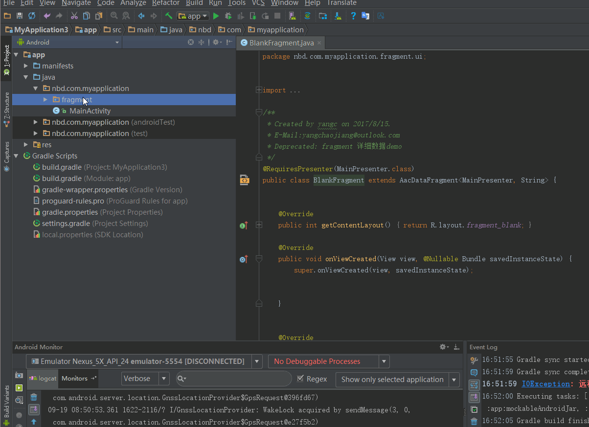
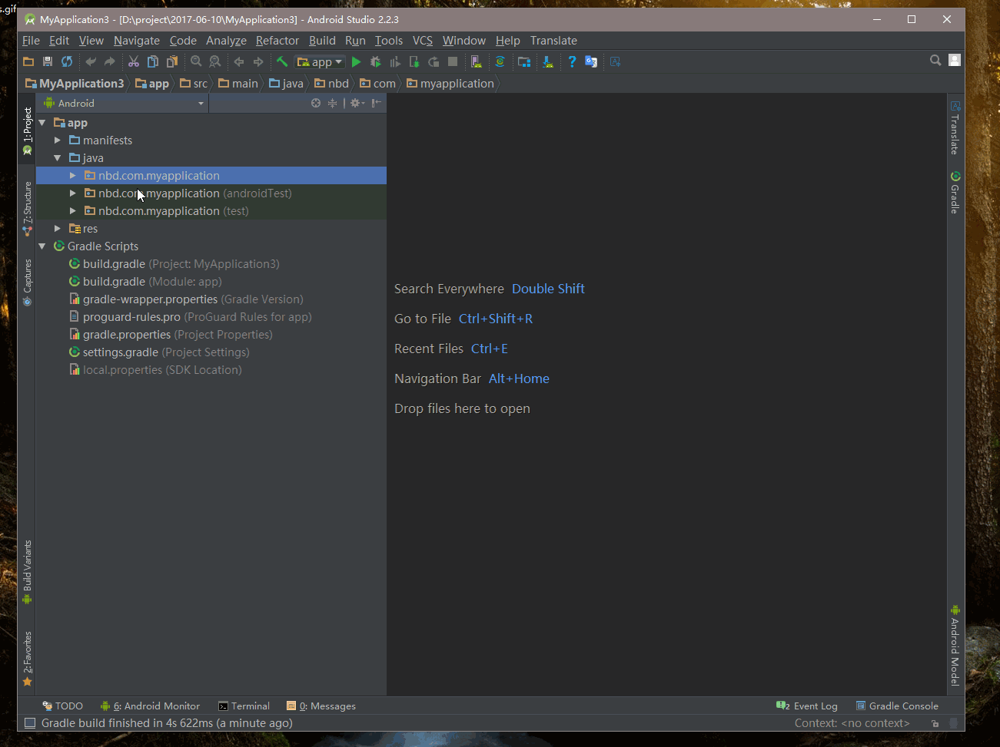

# AAcHelper
对于AaComponents 进行插件化封装,实现快速mvp模板代码

####  预览
  

### 使用说明
   1.[需要引用AaComponents库>戳我](https://github.com/yangchaojiang/AaComponents)
     

### 安装插件 
 1.下载[AAcHelper.jar](https://github.com/yangchaojiang/AAcHelper/blob/master/AAcHelper.zip)
 2.打开你Android studio  安装插件
 
 安装如图

 
